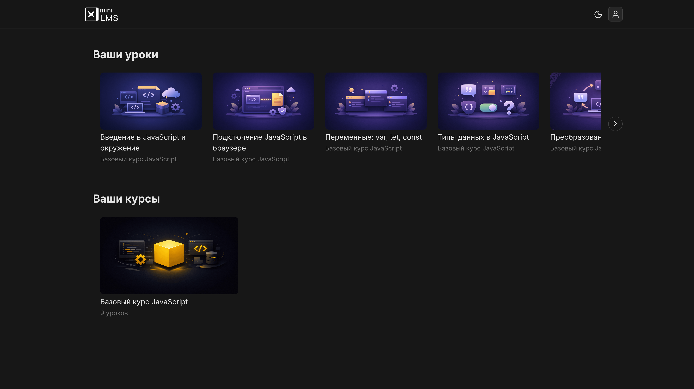
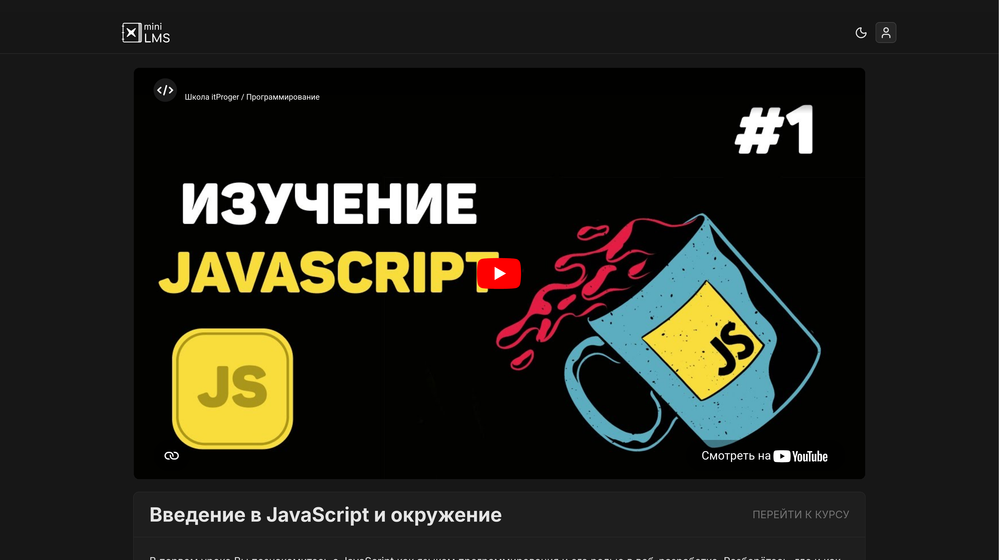
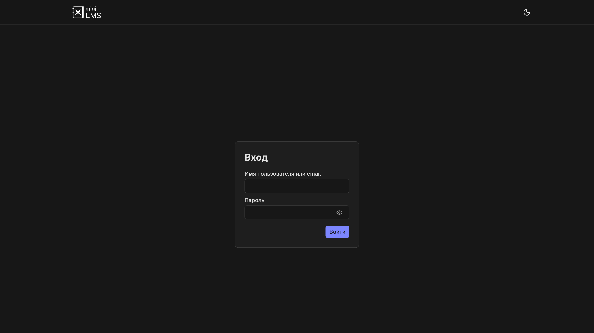

# mini-lms

`mini-lms` is a small authenticated learning platform for assigned-course access and lesson delivery. Learners sign in, see only the content available to them, open courses, and consume lessons with video, rich text, previews, and downloadable attachments.

The repository is a `pnpm` monorepo with a learner-facing Vue application in `apps/web` and a Strapi backend in `apps/cms`. Together they cover the full flow from content management and enrollment rules to protected content delivery in the frontend.



_Learner dashboard with assigned lessons and courses._

## What This Project Demonstrates

- Authenticated product flow with a clear boundary between public sign-in and protected learning screens
- Access-controlled content delivery where users only see the courses and lessons available to them
- Clean frontend structure built around route-level pages, focused features, and domain stores
- CMS-driven content operations with Strapi handling courses, lessons, media, users, and access rules

## Main User Flow

1. Sign in through the learner-facing authentication screen
2. View assigned lessons and courses on the overview dashboard
3. Open a course and navigate its ordered lesson list
4. Consume lesson content with video, text, and downloadable attachments

## Core Screens

### Course Page


_Course page with ordered lesson navigation._

### Lesson Page



_Lesson page with protected content and attachments._

### Authentication



_Authentication flow for learner access._

## Architecture At A Glance

- `apps/web` is the learner-facing frontend built with Vue 3, Vite, Vue Router, Pinia, and Nuxt UI
- `apps/cms` is the Strapi backend that stores courses, lessons, media, users, and lesson access rules
- Frontend pages load assigned content from the CMS API and render resilient loading, empty, and error states
- The backend content model connects enrolled users to courses and courses to lessons, which keeps access logic explicit

## Key Technical Decisions

- Vue 3 + Vite for a fast, lightweight frontend development setup
- Pinia stores for domain state around courses, lessons, and the authenticated user profile
- Strapi as an editable content backend instead of hardcoded lesson data
- Access-aware API usage so the UI works with protected course and lesson content
- Dedicated UI states for loading and failures on overview, course, and lesson screens

## Requirements

- Node.js `>=18 <=22`
- pnpm `10.x`

## Environment

Copy the example files before running the apps:

```bash
cp apps/web/.env.example apps/web/.env
cp apps/cms/.env.example apps/cms/.env
```

The web app currently expects:

- `VITE_API_BASE`

The CMS example includes the local server settings and Strapi secrets required to boot the app.

## Run and Build

Install dependencies from the repository root:

```bash
pnpm install
```

Start both apps together:

```bash
pnpm dev
```

Build both apps:

```bash
pnpm build
```

Use the root commands when you want to work with the whole stack. Use app-specific commands when you only need one app.

## Useful Commands

Run only the frontend:

```bash
pnpm dev:web
pnpm build:web
pnpm test:web
pnpm lint:web
```

Run only the CMS:

```bash
pnpm dev:cms
pnpm build:cms
```

You can also run commands directly with pnpm filters:

```bash
pnpm --filter web dev
pnpm --filter cms dev
```
